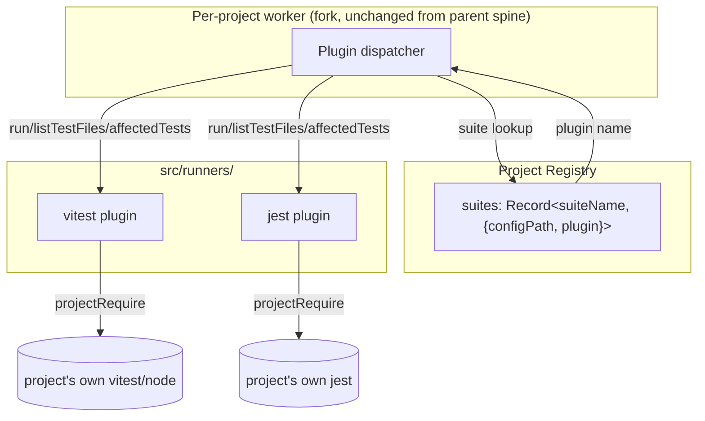
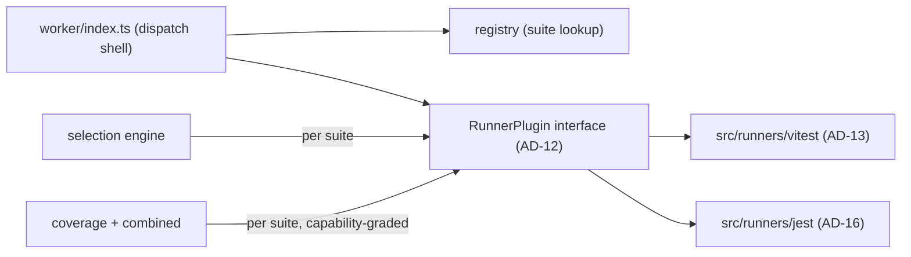

# Architecture Spine — test-server-mcp / Epic 7

## Design Paradigm

**Runner-plugin adapter**, layered inside the existing singleton-daemon + per-project-worker
paradigm (parent spine, unchanged). Today `worker/index.ts` resolves `vitest/node` directly at
two sites (`runVitest`, `buildAndPersistCoverageMap`). Epic 7 collapses both into a single
`RunnerPlugin` interface implemented once per runner (`src/runners/vitest/`, `src/runners/jest/`);
the worker becomes a dispatch shell that calls the active suite's plugin and never resolves a
runner package itself. This fulfills the parent spine's AD-2 ("Jest/pytest are
future adapters, not present code") rather than introducing a new invariant.



## Inherited Invariants

| Inherited | From parent | Binds here |
| --- | --- | --- |
| AD-1 Programmatic Interface First | architecture-test-server-mcp-2026-07-10 | MCP tools stay authoritative; no new UI surface for plugin config |
| AD-1a Dry Run (plan/commit) | architecture-test-server-mcp-2026-07-10 | Per-suite plans still cache/expire the same way |
| AD-2 Test Runner Abstraction | architecture-test-server-mcp-2026-07-10 | This epic is AD-2's deferred adapter model, now built out |
| AD-3 Coverage Mapping Ownership | architecture-test-server-mcp-2026-07-10 | The coverage component stays sole owner, now per-suite |
| AD-4 Immutable Results | architecture-test-server-mcp-2026-07-10 | Unaffected; results still atomic snapshots |
| AD-5 Dependency Direction (daemon-internal) | architecture-test-server-mcp-2026-07-10 | `src/runners/*` sit at the same depth as `worker/`; daemon core doesn't import a plugin module directly |
| AD-6 Single Daemon over Streamable HTTP | architecture-test-server-mcp-2026-07-10 | Unaffected |
| AD-7 Project-Local Execution | architecture-test-server-mcp-2026-07-10 (amended in place by this epic — see note) | Generalizes from "a project's Vitest" to "a project's runner, of any kind"; same isolation invariant |
| AD-8 State Topology | architecture-test-server-mcp-2026-07-10 | Per-suite state nests one level deeper under the existing per-project topology |
| AD-9 Coverage Build Method | architecture-test-server-mcp-2026-07-10 | Stays the Vitest plugin's internal method only; not generalized by this epic |
| AD-10 Recall-Prioritised Selection | architecture-test-server-mcp-2026-07-10 | Extends to the new "coverage unavailable" case — selection itself is unaffected, only the coverage/threshold gate is absent |
| AD-11 Positioning Invariant | architecture-test-server-mcp-2026-07-10 | Unaffected; "project-local version isolation" differentiator generalizes to "runner isolation" |

**Note on AD-7:** its literal Rule text ("...the daemon never imports a project's Vitest") is
amended in place in the parent spine as part of this epic (id kept stable, parent `updated`
bumped) — this fulfills AD-2's already-stated intent in the same parent spine rather than
weakening or contradicting it. See the parent spine's own changelog note.

## Invariants & Rules



### AD-12 — RunnerPlugin Interface
- **Binds:** test execution, coverage, selection (fulfills inherited AD-2)
- **Prevents:** runner-specific logic leaking outside one plugin module; incompatible per-runner reimplementations of selection/coverage/confidence; a plugin call silently defaulting to the wrong config when a project has more than one suite using the same plugin
- **Rule:** `RunnerPlugin = { name, detect(projectRoot), capabilities: { coverage: "none"|"summary"|"line-hit", changedFileDetection: boolean, watch: boolean }, listTestFiles(projectRoot, configPath), run(projectRoot, configPath, testFiles, opts), affectedTests?(projectRoot, configPath, changedFiles), readCoverageThresholds?(projectRoot, configPath) }`. Every method except `detect` (the method that scans *for* a config) takes the suite's `configPath` (AD-14) explicitly — no method relies on cwd-based auto-discovery to pick a config. Only the plugin module may resolve the underlying runner package (`projectRequire`); `worker/index.ts` never calls `projectRequire("vitest/node")` (or any runner package) itself once this lands.

### AD-13 — Zero-Behavior-Change Vitest Extraction
- **Binds:** the Vitest plugin specifically
- **Prevents:** an extraction that's secretly a rewrite, hiding regressions behind refactor cover
- **Rule:** `src/runners/vitest/index.ts` is a verbatim move of the current worker functions (`runVitest` incl. `runOnce`/reporter shapes, `measureCoverage`, `discoverTestFiles`, `readCoverageThresholds`) behind AD-12's interface — same options, same reporter callbacks, same `coverage-final.json` handling. The acceptance bar is the existing test suite passing unmodified; both current `projectRequire("vitest/node")` sites (`runVitest` ~L307, `buildAndPersistCoverageMap` ~L516) move here, and none remain in `worker/index.ts`.

### AD-14 — Multi-Suite Registry Model
- **Binds:** registry, CLI `register`
- **Prevents:** two suites of one project silently colliding on one `projectId`/config/coverage-map; ambiguity over which runner applies when more than one config file is present; two auto-detected suites silently overwriting one Record key; the auto-detect vs. explicit-override merge behaving unpredictably; two plugins' `detect()` both matching one config with no tie-break
- **Rule:**
  - `RegisteredProject` gains `suites: Record<suiteName, { configPath, plugin: RunnerPlugin["name"] }>`. The existing top-level `configPath` field is **deprecated** in favor of per-suite `configPath` (a project can now have more than one configPath, one per suite). Migration: an already-registered single-suite project has its existing `configPath` auto-migrated into one suite entry (name inferred from the detected plugin, e.g. `unit`) on next `register`/daemon-start; `projectId` is unchanged.
  - **Collision rule:** auto-detected suite names must be unique per project; on a name collision, auto-detect suffixes with the plugin name (e.g. `unit-vitest`, `unit-jest`) rather than silently overwriting the Record entry.
  - **Override semantics:** an explicit `--suite name:plugin:configPath` **upserts exactly that one named suite** — it never clears or replaces the rest of the `suites` map. Auto-detection is the default path, not the only one.
  - **Detect precedence:** the plugin registry declares a fixed probe order; the first plugin whose `detect()` returns true for a given config file wins. A config file whose name/shape ambiguously matches more than one plugin's pattern is **not** silently guessed — `register` surfaces the ambiguity and requires the explicit `--suite` form.
  - Everything currently keyed by `projectId` alone (coverage map, history, plans) additionally keys by `suiteName`, one directory level deeper under the existing per-project state topology (AD-8) — e.g. `.test-mcp/<suite>/coverage-map.json`.

### AD-15 — Per-Suite Selection/Coverage/Confidence Scoping
- **Binds:** selection, coverage, combined coverage, confidence, orchestrator run-state/history/failure-detail bookkeeping, and the MCP tool surface (`run_tests` — including its already-present-but-unwired `suite` param — `get_status`, `get_failure_details`)
- **Prevents:** one suite's changed-file/coverage data being attributed to a different suite's tests (false confidence, wrong test selection); two suites of one project clobbering each other's run status/history/failure-detail because a bookkeeping layer stayed `projectId`-only while the coverage layer was correctly suite-scoped
- **Rule:**
  - **Suite-scoped types:** `SelectionEngine.plan`, `CoverageMapFile`, `CoverageDataFile` (the combined-coverage input store, `coverage-data.json`), `CombinedCoverage`, and `TestPlan`/`ProjectRef` (the dry-run plan cache) all become suite-scoped (add a `suiteName` dimension alongside the existing `projectId`) — no exceptions; a type left out of this list is a spine defect, not an implementer's judgment call. None of these are ever merged across suites within one project.
  - **Orchestrator bookkeeping:** the orchestrator's `runState`/`lastFailures`/history `Map`s key on `(projectId, suiteName)`, not `projectId` alone.
  - **Confidence grading:** `Confidence`'s existing `{level: "high"|"degraded", reasons}` union gains a third level `"unavailable"`, asserted whenever the suite's bound plugin declares `capabilities.coverage === "none"`.
  - **Threshold gating:** `thresholdsMet` stays `undefined` in that case, using the same gating pattern already proven at `combined.ts:269-271` (today: `thresholdsMet` only set at confidence `high`) — never silently defaulted to a number, and never omitted without a reason.

### AD-16 — Jest as Seam-Validation Plugin
- **Binds:** the Jest plugin specifically
- **Prevents:** scope creep into full Jest feature parity during Epic 7; asserting a Jest capability that wasn't actually confirmed against Jest's real API
- **Rule:** `changedFileDetection` uses Jest's real flags — `--onlyChanged`/`-o` (working-tree diff) or `--changedSince <ref>` (branch/commit diff); there is no `--changed` flag. `capabilities.coverage` is `"summary"` when Jest's `coverageReporters` output (`coverage-final.json`, raw Istanbul shape — its default reporters already include `"json"`) is parsed with the **already-pinned** `istanbul-lib-coverage` dependency (Story 6.10) — the same library already used for Vitest's raw coverage, no new runtime dependency needed. No per-test-file coverage-map (line-hit) requirement, no static-graph `affectedTests` parity requirement. Its test suite follows the same hermetic-fixture-project pattern as the Vitest plugin's tests, proving the interface holds rather than matching Jest's feature surface.
- **Open question (escalation trigger, not resolved by this spine):** the plain `jest` package's `run()` calls `process.exit()` on completion, which would kill the worker subprocess. The non-exiting, structured-result API is `runCLI` from the separate `@jest/core` package; whether that's reliably `projectRequire`-resolvable from a project that only declares `jest` (not `@jest/core` directly) is unconfirmed, especially under pnpm's strict resolution. Before writing `run()`, the Jest plugin's story must spike this and escalate (per this repo's dependency-authorization rule) if `@jest/core` isn't reliably resolvable.

## Consistency Conventions

| Concern | Convention |
| --- | --- |
| Naming | `RunnerPlugin` implementations live under `src/runners/<name>/`; the plugin object export is always named `<name>Plugin` (e.g. `vitestPlugin`, `jestPlugin`) |
| Data & formats | `suiteName` is a user-chosen slug (register-time, defaults to a plugin-derived name like `unit`/`e2e` on auto-detect); per-suite persisted JSON keeps the existing `schemaVersion` convention (AD-8), bumped independently per file that changes shape |
| State & cross-cutting | No plugin may write outside `.test-mcp/<suite>/`; a plugin failing `detect()` or throwing during `run()` must degrade to a clear daemon-level error (existing `{code, message, details?}` envelope), never crash the daemon |

## Stack

| Name | Version |
| --- | --- |
| (inherited from parent — unchanged) | — |
| Jest (via project-resolved `jest` package, plugin only) | project-resolved; no daemon-side pin, resolved the same `projectRequire` way Vitest is today |

## Structural Seed

```text
src/
  runners/          # NEW - one subdir per plugin, plus the registry/dispatcher
    index.ts         # RunnerPlugin registry + dispatch (AD-12)
    vitest/          # extracted from worker/index.ts, zero behavior change (AD-13)
    jest/            # seam-validation only (AD-16)
  worker/            # thins to orchestration + plugin dispatch; no more projectRequire("vitest/node")
  registry/          # RegisteredProject gains `suites` (AD-14)
  selection/         # SelectionEngine.plan gains suite scoping (AD-15)
  coverage/          # CoverageMapFile / combined.ts gain suite scoping + "unavailable" confidence (AD-15)
```

## Capability → Architecture Map

| Capability / Area | Lives in | Governed by |
| --- | --- | --- |
| Runner abstraction | `src/runners/` | AD-12, AD-2 (inherited) |
| Vitest execution (unchanged behavior) | `src/runners/vitest/` | AD-13, AD-7 (inherited, amended) |
| Jest execution (seam validation) | `src/runners/jest/` | AD-16 |
| Multi-suite registration | `src/registry/` | AD-14, AD-8 (inherited) |
| Per-suite selection | `src/selection/` | AD-15, AD-10 (inherited) |
| Per-suite coverage + confidence grading | `src/coverage/` | AD-15, AD-3, AD-9 (inherited) |
| Per-suite orchestrator bookkeeping + MCP surface | `src/orchestrator/`, `src/mcp/` | AD-15 |

## Open Questions

- **Jest embeddable run API** — see AD-16's open question: `@jest/core`'s `runCLI` resolvability via `projectRequire` is unconfirmed; the Jest plugin story must spike this first.

## Deferred

- pytest, `go test`, or any other non-JS plugin — AD-2 leaves room, not built this epic.
- Generic shell-command/subprocess/Docker plugin escape hatch — its own later discovery task (container lifecycle, cold-start latency vs. fast-incremental value).
- A universal cross-runner coverage merge format — each plugin's coverage capability stays independently graded/reported; no cross-plugin merge.
- Function-level test selection granularity — unrelated to runner pluggability; may stay permanently out of scope (few plugins could support it).
- CRG/Story-6.9-backed impact analysis — parked separately, an unrelated seam.
