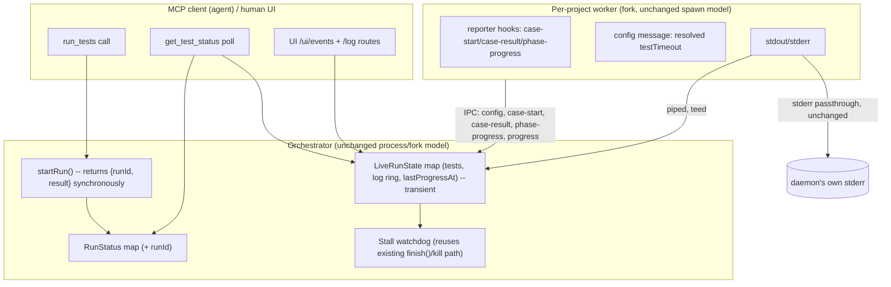
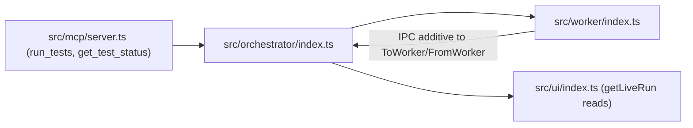

# Architecture Spine — test-server-mcp / Epic 8

## Design Paradigm

**Async job-handle + live-observability layer**, added inside the existing singleton-daemon +
per-project-worker paradigm (parent spine, unchanged). Today a `run_tests` MCP call awaits its
whole worker execution synchronously before responding. This epic decouples the two: the
orchestrator's `startRun` returns a `runId` the instant a run is accepted, while its `result`
promise keeps resolving in the background exactly as today. The MCP handler races that promise
against a configurable grace period and answers with either the finished result (today's exact
behavior, unchanged) or a job handle to poll. In parallel, the worker gains optional per-test
reporter hooks and a stdout/stderr tee so an in-flight run is observable (live pass/fail list,
console tail) instead of opaque, and a stall watchdog closes the one failure mode neither
mechanism catches: a worker that stops making progress and never returns at all.



## Inherited Invariants

| Inherited | From parent | Binds here |
| --- | --- | --- |
| AD-1 Programmatic Interface First | architecture-test-server-mcp-2026-07-10 | `get_test_status` (MCP) must carry everything the human UI can show — see AD-21, which resolves the specific fidelity question this epic raises |
| AD-4 Immutable Results | architecture-test-server-mcp-2026-07-10 | Unaffected: the final `TestResult` stays an atomic immutable snapshot. This epic's live test list / log ring is a *different*, deliberately mutable, transient layer that exists only before that snapshot lands — never a second, competing notion of "the result" |
| AD-7 Project-Local Execution | architecture-test-server-mcp-2026-07-10 | Unaffected: still one forked worker per run, still resolves the runner from the project itself. The new stdio piping (AD-19) and reporter hooks (AD-18) are additions to that same worker, not a new execution path |
| AD-8 State Topology | architecture-test-server-mcp-2026-07-10 | This epic's live state is deliberately **outside** this topology (see AD-19's constraint) — in-memory only, not a fourth persistence tier; the project-level `defaultRunWaitMs` override (AD-17) is the one piece that *does* land in the existing `<git-root>/.test-mcp/config.json` |

## Invariants & Rules



### AD-17 — Async `run_tests` with a configurable grace period
- **Binds:** `run_tests` MCP tool, `Orchestrator` public API (fulfills C14)
- **Prevents:** a long run holding one MCP tool call open past a client's own request timeout; a caller with no way to recover a `runId` for a still-running job; a second polling surface competing with the existing one; a race between the result and the grace-period timer producing a job-handle for a run that already finished
- **Rule:** `Orchestrator.startRun(project, opts): {runId, result: Promise<TestResult>}` generates `runId` synchronously at call time (moved out of `executeWorker`'s internals) and returns immediately; `runTests()`/`runPlan()` become thin wrappers (`const {result} = this.startRun(...); return result;`) so every existing direct caller is unaffected. This includes `enqueue`'s pre-existing empty-selection short-circuit (today's separate `randomUUID()` call for a no-op run) — it now takes its `runId` from the same `startRun` call rather than minting its own, so `RunStatus.runId` and the persisted `RunRecord.runId` always agree. `RunStatus` gains `runId?: string`. The `run_tests` MCP handler resolves an effective `waitMs` — per-call `waitMs` argument (`z.number().nullable().optional()` — `null` must validate and reach the resolver distinctly from omitted, not be stripped) → project's `.test-mcp/config.json` `defaultRunWaitMs` → daemon `DaemonConfig.defaultRunWaitMs` → built-in default `10_000` — where an explicit `null` at any layer means wait forever (today's exact synchronous behavior, a deliberate non-default opt-out). It races `result` against that window: on an exact tie, **the result always wins** — `run_tests` never returns a job-handle for a run whose result was already available. Settles first → return the full `TestResult`, byte-for-byte as today; window elapses first → return `{runId, projectId, state:"running", message}` while the run keeps executing regardless. `get_test_status` is the only poll surface — no new tool — extending the pattern already documented for `start_watch`.

### AD-18 — Live per-test progress via optional reporter hooks
- **Binds:** worker reporter wiring, orchestrator live state (fulfills C15)
- **Prevents:** claiming per-test live status on a project whose Vitest can't provide it; unbounded memory growth from a huge suite's test list; a killed run's straggling message corrupting the next run's live state
- **Rule:** the worker's `runOnce()` reporter gains `onTestCaseReady`/`onTestCaseResult` (Vitest 3+ optional hooks) alongside the existing `onTestModuleEnd`, sending `case-start`/`case-result` IPC messages — each carrying `runId` (same discipline as every existing `FromWorker` variant), `file`, `name`, and — for `case-result` — `status` (reuses `TestResult.tests[].status`'s exact three-literal enum `passed`/`failed`/`skipped`; Vitest's `pending` state folds into `failed` exactly as `mapModulesToResult` already does — `onTestCaseResult`'s own contract guarantees `result()` is never `pending` by the time it fires, so no fourth literal reaches the wire). A project whose Vitest predates these hooks simply never triggers them; no explicit feature-detection is needed on our side. The orchestrator discards any `config`/`case-start`/`case-result`/`phase-progress` message whose `runId` doesn't match the run currently occupying that project's slot — the existing `runId === runId` guard already applied to `progress`/`result`/`error` extends to all four new types, closing the window where a just-killed worker's straggling send (its `finish()`-triggered `child.kill()` is `SIGTERM`, not instant) could otherwise land against the next run. The orchestrator keeps a `MAX_LIVE_TEST_ENTRIES = 2000` per-project live test list keyed `(file, name)` — a **ring**, not a frozen cap: past the limit, the oldest entry is evicted per new `case-start`/`case-result`, so the visible list is always the most recent 2000, never stuck on the first 2000. Both the test list and the log ring (AD-19) are retained through a run's end (success, error, or watchdog kill) and only cleared when the **next** run for that project starts — an operator inspecting `GET .../log` or the UI right after a stall-kill must still see the state that led to it, not a wiped slate.

### AD-19 — Bounded, dual-channel live log capture
- **Binds:** `executeWorker`'s `fork()` call, orchestrator live state (fulfills C16)
- **Prevents:** an operator's existing daemon-stderr-based debugging silently breaking; unbounded memory growth from a chatty suite; raw log output being mistaken for a watchdog-resetting progress signal
- **Rule:** `fork()`'s `stdio` moves from `["ignore","ignore","inherit","ipc"]` to `["ignore","pipe","pipe","ipc"]`. stderr is **teed**: captured into a bounded (`MAX_LOG_LINES = 1000`, `MAX_LOG_LINE_CHARS = 4000`) per-project ring buffer *and* still written through to the daemon's own `process.stderr` unchanged. stdout is captured into the same ring but is **not** forwarded anywhere else — new visibility, not new noise. A partial (no-newline) chunk is held as residual (capped `MAX_RESIDUAL_CHARS = 8000`, force-flushed past that) and flushed as a final line when the run settles; the ring itself persists until the next run starts (AD-18). Log-line arrival is **never** a watchdog-reset signal (AD-20) — only `case-start`/`case-result`/module `progress`/`phase-progress` reset the stall timer, so a wedged worker that merely keeps writing to stderr (e.g. retry-logging from a hung `vitest.close()`) is still correctly detected as stalled. This live state is explicitly outside the `<git-root>/.test-mcp/` persistence topology (AD-8) — in-memory only, not a fourth durable tier.

### AD-20 — Stall watchdog, on by default, reusing the existing kill path
- **Binds:** worker config-reporting, orchestrator kill path (fulfills C17)
- **Prevents:** a genuinely wedged worker (e.g. `vitest.close()` never resolving) hanging forever with no operator visibility; a false-positive kill during the coverage-measurement phase, which today emits zero progress signals for its entire duration; a second, divergent kill mechanism alongside the existing opt-in whole-run timeout; an unmonitored window before the worker's own config discovery call completes; a schema/handler rollout mismatch turning new observability messages into hard run failures
- **Rule:** a **provisional** watchdog arms the instant the worker is forked, using `staleTestGraceMs` alone (worker-side discovery — the `createVitest()` call itself, described below — can hang too, exactly the failure class this AD exists to catch, and must not be exempt from it). Before the real run starts, the worker reads the project's resolved Vitest `testTimeout` via that lightweight `createVitest()` discovery call — the same pattern already used by `readCoverageThresholds` — and reports it via a new `config` IPC message; on receipt, the orchestrator replaces the provisional watchdog with the real one, armed at `testTimeout + staleTestGraceMs` (default grace `5000`ms). Either watchdog resets on every test-level progress signal: `case-start`/`case-result` when supported, module-level `progress` as the fallback signal when they aren't, and — **required, not optional** — a new `phase-progress` message (`{file, completed, total}`, surfaced through `get_test_status`/the UI identically to test-level progress, not merely an internal reset signal) emitted once per file during the coverage-measurement phase (`buildAndPersistCoverageMap`'s silent per-file `measure` reporter), closing the one phase that would otherwise starve the watchdog of any signal at all. On fire, the watchdog kills the worker through the **same** `finish()` helper the existing `runTimeoutMs` cap already uses — no second kill path — producing a `WorkerError` reading `worker stalled: no test progress for {N}ms (threshold {N}ms = testTimeout {N}ms + grace {N}ms)`, distinguishable from both `worker timed out after {N}ms` (the whole-run cap) and `worker exited (code {c}, signal {s}) before returning a result` (an unexpected process exit). The `FromWorker` Zod schema additions for `config`/`case-start`/`case-result`/`phase-progress` (AD-18/19/20) must land in the **same change** as any worker code that sends them — `parseFromWorker`'s existing reject-unknown-shape behavior (`orchestrator/index.ts` ~line 475-488) hard-fails the *entire run* on an unrecognized message, never silently drops it, so send-before-accept is a shipped regression, not a harmless gap.

### AD-21 — MCP/UI live-state parity
- **Binds:** `get_test_status` payload shape, `src/ui/index.ts` snapshot + new log routes (reconciles AD-1 for this epic's new surfaces)
- **Prevents:** a live-state fidelity gap where a human watching the UI can see something an MCP-only agent structurally cannot; an ambiguous wire shape two independent builders could name differently
- **Rule:** `get_test_status`'s MCP response nests all live data under one `live: {tests, log, phase?, lastProgressAt}` key — never spread flatly, never reusing `lastResult`'s existing `tests` name — carrying the **full** bounded live state (up to the same `MAX_LIVE_TEST_ENTRIES`/`MAX_LOG_LINES` caps as the in-memory ring, no further slicing) on every on-demand call; a poll is a deliberate single-project request, not a broadcast, so there is no MCP-side reason to trim it further (excepting purely mechanical per-connection SSE follow-cursor state, which is connection bookkeeping, not project data, and has no MCP equivalent by definition). The human UI's `/ui/events` SSE snapshot embeds the identical `live` shape, pre-sliced to a smaller view (last 20 log lines, most-recent 200 tests) purely for push-payload/frequency reasons — a repeated push to every connected browser tab across every running project on every single test event. The UI's dedicated `GET /ui/api/projects/:id/log` (one-shot) and `GET /ui/api/projects/:id/log/events` (follow) routes surface the same full data the SSE snapshot elides — nothing is UI-exclusive; an MCP caller gets equivalent fidelity by polling `get_test_status` repeatedly instead of subscribing to a browser-facing stream.

## Consistency Conventions

| Concern | Convention |
| --- | --- |
| Naming | New `FromWorker` variants: `config`, `case-start`, `case-result`, `phase-progress` (kebab-case `type` literals, matching existing `progress`/`result`/`error`). Live-state fields: `LiveTestEntry`, `LiveLogLine`, `LiveRunState` (orchestrator-internal, not exported types) |
| Data & formats | All four new IPC message types are additive to the existing `ToWorker`/`FromWorker` discriminated union with their own Zod schema variant — no breaking change to existing shapes, matching this repo's `schemaVersion`/additive-envelope discipline |
| State & cross-cutting | Live state (test list, log ring) is in-memory only, transient, cleared when a run settles — never persisted to `<git-root>/.test-mcp/` history, which stays the durable end-of-run record. `/ui*` routes (including the two new log routes) stay strictly read-only, loopback + Host/Origin gated, unauthenticated — no new mutation surface anywhere in the human UI |

## Stack

| Name | Version |
| --- | --- |
| (inherited from parent — unchanged) | — |

## Structural Seed

```text
src/
  orchestrator/
    index.ts        # + startRun(), LiveRunState map, stall watchdog, getLiveRun() (AD-17, AD-18, AD-19, AD-20)
  worker/
    index.ts         # + readResolvedRunConfig(), onTestCaseReady/onTestCaseResult, phase-progress send (AD-18, AD-20)
  types/
    ipc.ts           # + config, case-start, case-result, phase-progress FromWorker variants (AD-18, AD-19, AD-20)
  mcp/
    server.ts        # run_tests: waitMs race + job-handle response; get_test_status: full live payload (AD-17, AD-21)
  ui/
    index.ts         # uiSnapshot(): sliced `live` field; new /log, /log/events routes (AD-21)
  daemon/
    index.ts         # DaemonConfigSchema: + defaultRunWaitMs, staleTestGraceMs (AD-17, AD-20)
  cli/
    main.ts          # ensureProjectConfig(): per-project config gains optional defaultRunWaitMs (AD-17)
```

## Capability → Architecture Map

| Capability / Area | Lives in | Governed by |
| --- | --- | --- |
| C14 async `run_tests` | `src/orchestrator/`, `src/mcp/server.ts`, `src/daemon/`, `src/cli/main.ts` | AD-17, AD-1 (inherited) |
| C15 live per-test progress | `src/worker/`, `src/orchestrator/` | AD-18, AD-4 (inherited, distinguished) |
| C16 log tail with follow | `src/orchestrator/`, `src/ui/` | AD-19, AD-8 (inherited) |
| C17 stall watchdog | `src/worker/`, `src/orchestrator/` | AD-20 |
| MCP/UI parity for live state | `src/mcp/server.ts`, `src/ui/index.ts` | AD-21, AD-1 (inherited) |

## Deferred

- A debounce on `/ui/events` push frequency — AD-21's SSE snapshot fires on every single test event across every running project today; not built this epic, flagged as a likely follow-up if push frequency becomes a practical problem in production.
- Any change to the MCP SDK client's own default request-timeout behavior (`DEFAULT_REQUEST_TIMEOUT_MSEC`) — out of this daemon's control. AD-17's grace period makes it moot for the default/recommended configuration; an operator explicitly configuring `waitMs: null` (wait forever) knowingly opts back into that client-side risk.
- Resumable/event-store-backed MCP transport streams (would let a single long tool call survive a transport hiccup without falling back to polling) — unrelated seam, not part of this epic's async model.
