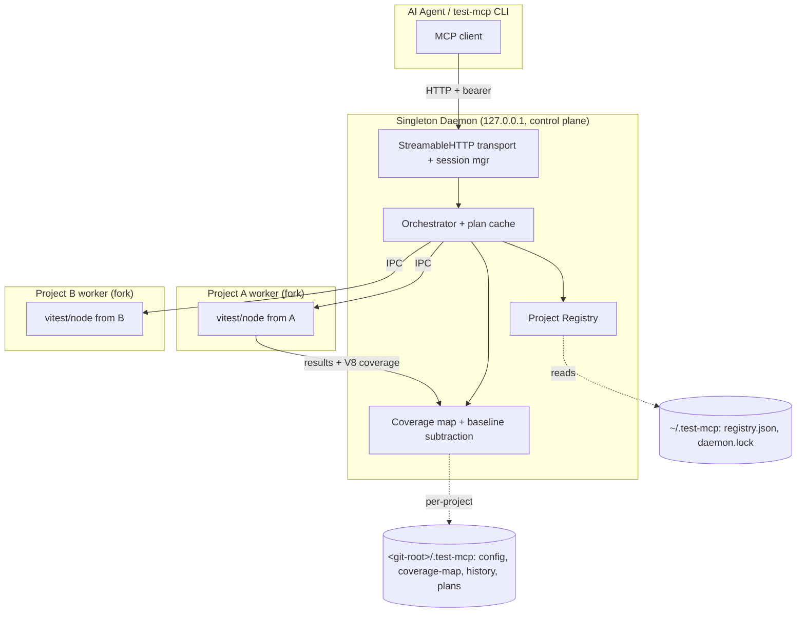

# Architecture Spine — test-server-mcp

## Design Paradigm

**Singleton daemon (control plane) + one isolated worker subprocess per project (data
plane), over IPC.** One long-lived daemon per system speaks MCP (Streamable HTTP) and owns
the project registry; it never runs tests itself. Each `run_tests` is delegated to a
forked worker whose cwd is the project root and which resolves `vitest/node` from *that
project's* `node_modules`. Process isolation between daemon and workers (and between
workers) is the top-level invariant. The classic layered/inward-dependency discipline
(AD-5) survives only as an internal rule for daemon code.



## Inherited Invariants

*No parent spine — top-level architecture.*

## Invariants & Rules

### AD-1 — Programmatic Interface First
- **Binds:** all capabilities · **Prevents:** UI becoming the primary delivery path
- **Rule:** MCP is authoritative; the Phase-2 HTTP UI is convenience only and cannot expose anything MCP doesn't.

### AD-1a — Dry Run (plan/commit)
- **Binds:** test orchestration · **Prevents:** executing unwanted tests during agent iteration
- **Rule:** `dryRun` returns a `TestPlan` (`planId`, files, reasoning, `expiresAt`); `run_tests({planId})` executes exactly that cached plan; expired → re-plan.

### AD-2 — Test Runner Abstraction
- **Binds:** test execution · **Prevents:** Vitest specifics leaking into orchestration
- **Rule:** runner access sits behind an adapter interface; only the worker layer knows Vitest. Jest/pytest are future adapters, not present code.

### AD-3 — Coverage Mapping Ownership
- **Binds:** coverage intelligence · **Prevents:** multiple owners of coverage data
- **Rule:** the daemon's coverage component is sole owner; all queries route through it; no ad-hoc coverage reads elsewhere.

### AD-4 — Immutable Results
- **Binds:** result reporting · **Prevents:** inconsistent views during long runs
- **Rule:** results are immutable snapshots; new results replace old ones atomically.

### AD-5 — Dependency Direction (daemon-internal)
- **Binds:** daemon code · **Prevents:** circular deps / entropy inside the daemon
- **Rule:** within daemon code, dependencies point inward toward domain; scoped to daemon internals now that process isolation is the outer boundary.

### AD-6 — Single Daemon over Streamable HTTP
- **Binds:** all client access · **Prevents:** competing daemons / port races / remote exposure
- **Rule:** one daemon per system (lockfile + known port), `StreamableHTTPServerTransport` stateful sessions; bind `127.0.0.1` only, mandatory Host+Origin validation, per-daemon bearer token. Optional stdio single-project mode.

### AD-7 — Project-Local Execution
- **Binds:** all test execution · **Prevents:** daemon deps contaminating results / cross-project version skew
- **Rule:** every run happens in a forked per-project worker (cwd = project root) resolving the runner from the project's own `node_modules`; the daemon never imports a project's test runner, of any kind. *(Wording generalized 2026-07-16 by the Epic 7 spine — from "the project's Vitest" to "the project's test runner, of any kind" — fulfilling AD-2's already-stated adapter intent, not weakening it. See `../architecture-epic-7-runner-plugin-api-2026-07-16/ARCHITECTURE-SPINE.md`.)*

### AD-8 — State Topology
- **Binds:** all persistence · **Prevents:** black-box central state / project pollution
- **Rule:** per-project state (coverage map, history, plans) in git-ignored `<git-root>/.test-mcp/`; daemon-global registry + lockfile central in `~/.test-mcp`, never inside a project; `projectId` = hash(abs path), pinnable; every persisted JSON carries `schemaVersion`.

### AD-9 — Coverage Build Method
- **Binds:** coverage-map construction (extends AD-3) · **Prevents:** setup-file pollution making everything look globally depended-on; reinventing a solved attribution core
- **Rule:** build source→test map single-pass from runtime V8 coverage, subtract the setup-file baseline, mark unmeasurable tests always-run. The snapshot-diff attribution algorithm is **ported/vendored from `testpick` (MIT)** into the coverage worker — not CLI-wrapped, not rebuilt; retain testpick's MIT copyright + license (`NOTICE`/`THIRD_PARTY_LICENSES` + module header). Spike-validated on a large frontend app.

### AD-11 — Positioning Invariant
- **Binds:** scope + external claims · **Prevents:** re-selling a commodity capability as the moat
- **Rule:** the differentiator is the delivery architecture (multi-project daemon + project-local version isolation + transparent repo-local state + baseline-subtraction correctness), NOT coverage-based selection (table-stakes as of 2026 — `testpick`/`vitest-agent`/`vitest-affected`/native `--stale`). Compete on execution and recall-first correctness.

### AD-10 — Recall-Prioritised Selection
- **Binds:** test-selection logic · **Prevents:** missed failures from over-aggressive skipping
- **Rule:** on ANY uncertainty (unknown/new file, setup-baseline module, unmeasurable test) fall back to the full suite.

## Consistency Conventions

| Concern | Convention |
| --- | --- |
| Naming | PascalCase classes/interfaces, camelCase functions/vars, plural collections |
| Data & formats | UUID v4 IDs (except `projectId` = path hash), ISO 8601 timestamps, error envelope `{code, message, details?}`, `schemaVersion` on every persisted JSON |
| State & cross-cutting | Config from `<git-root>/.test-mcp/config.json` + `~/.test-mcp`; structured JSON logging; secrets (bearer token) never logged |

## Stack

| Name | Version |
| --- | --- |
| TypeScript | ^5.x |
| Node.js | ^20 |
| @modelcontextprotocol/sdk | ^1.x (`McpServer`, `StreamableHTTPServerTransport`) |
| Vitest (via `vitest/node`) | project-resolved; target repo pins 4.1.9 |
| Worker IPC | `child_process.fork` |

## Structural Seed

```text
src/
  daemon/         # http transport, session mgr, project registry, orchestrator, plan cache
  worker/         # forked per-project runner: vitest/node driver + V8 coverage collector
  coverage/       # map build, setup-baseline subtraction, selection (AD-9, AD-10)
  cli/            # test-mcp register|start|stop|status (auto-boot singleton)
  shared/         # error envelope, logger, id/hash, schema types
tests/
package.json
# runtime state (NOT in src):
#   ~/.test-mcp/{registry.json, daemon.lock}
#   <git-root>/.test-mcp/{config.json, coverage-map.json, history.json, plans/}  (git-ignored)
```

## Capability → Architecture Map

| Capability (SPEC) | Lives in | Governed by |
| --- | --- | --- |
| C7 project registration | daemon/registry + cli | AD-6, AD-8 |
| C1 dry run (plan/commit) | daemon/orchestrator + plan cache | AD-1a |
| C2 run tests | daemon/orchestrator → worker | AD-2, AD-7, AD-4 |
| C3 incremental selection | coverage/selection | AD-9, AD-10 |
| C4 progress/status | daemon/session + orchestrator | AD-4, AD-6 |
| C5 minimal output | daemon/orchestrator | AD-4 |
| C8 project-local execution | worker | AD-7 |
| C9 coverage reverse-map | coverage | AD-3, AD-9 |

## Deferred

- Human web UI + real-time SSE/WebSocket push — Phase 2 (AD-1 keeps it behind MCP).
- ~~Jest/pytest adapters — future (AD-2 leaves room).~~ **In progress as of 2026-07-16**: the
  `RunnerPlugin` interface + Vitest extraction + Jest (seam-validation scope only) are now
  Epic 7 — see `../architecture-epic-7-runner-plugin-api-2026-07-16/ARCHITECTURE-SPINE.md`.
  Full Jest parity and pytest remain deferred, still covered by AD-2.
- Priority scoring, test-health monitoring — Phase 2.
- Fixture/setup-time cost tracking, ordering-dependency detection, resource-contention quotas — research-grade, deferred.
- Cross-platform beyond macOS; distributed caching; detailed error-recovery taxonomy.
